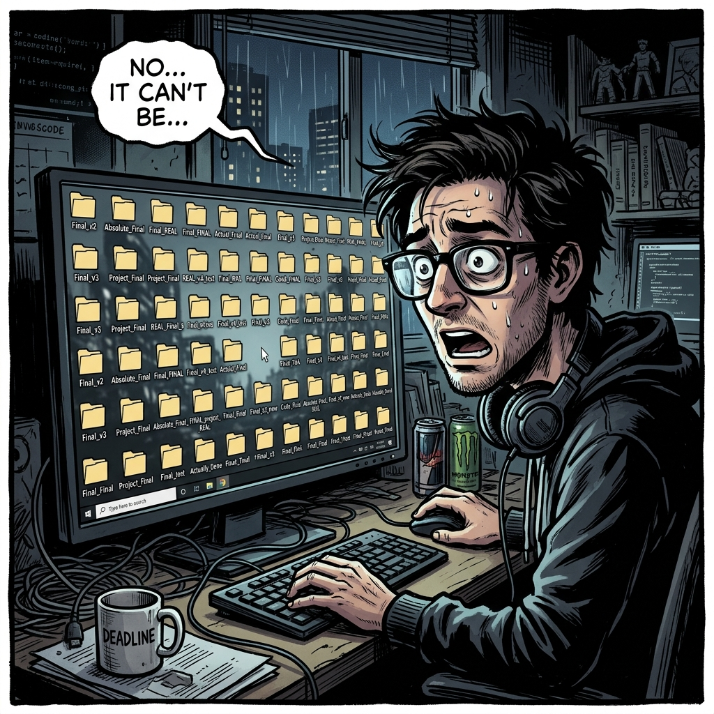
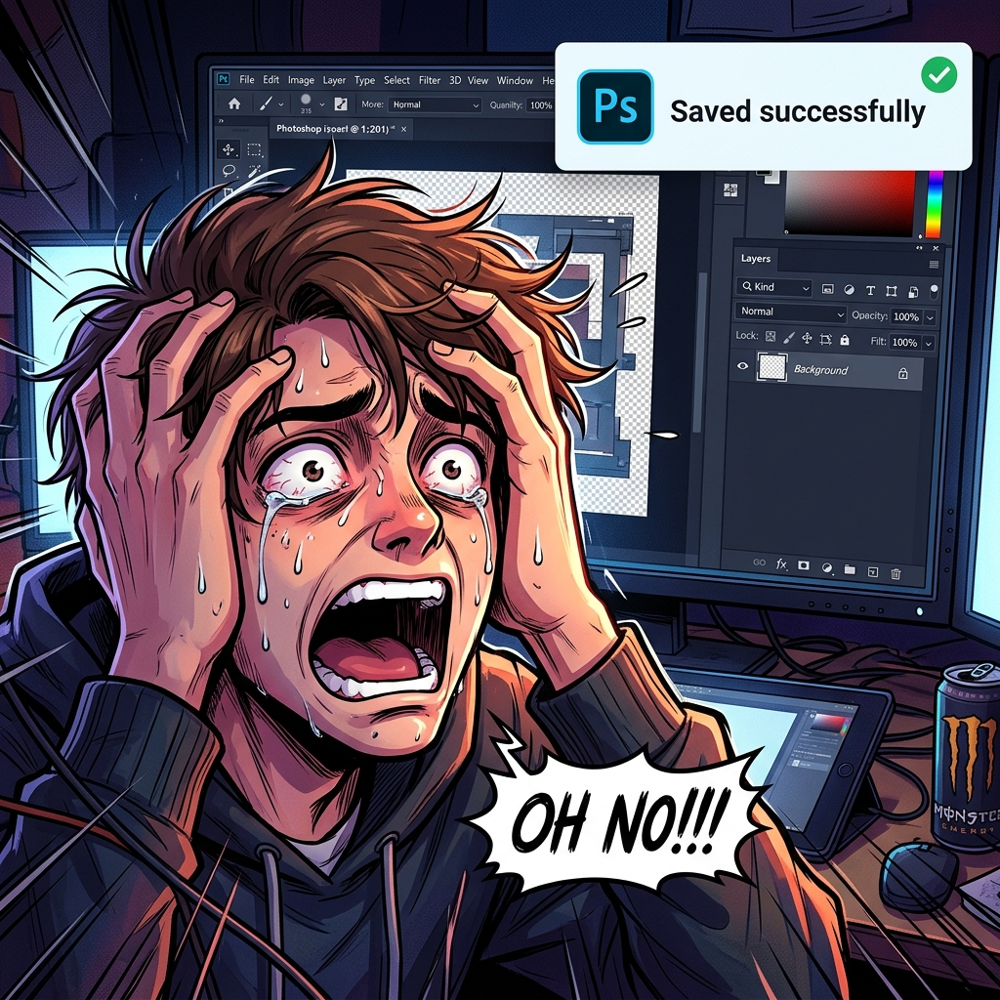
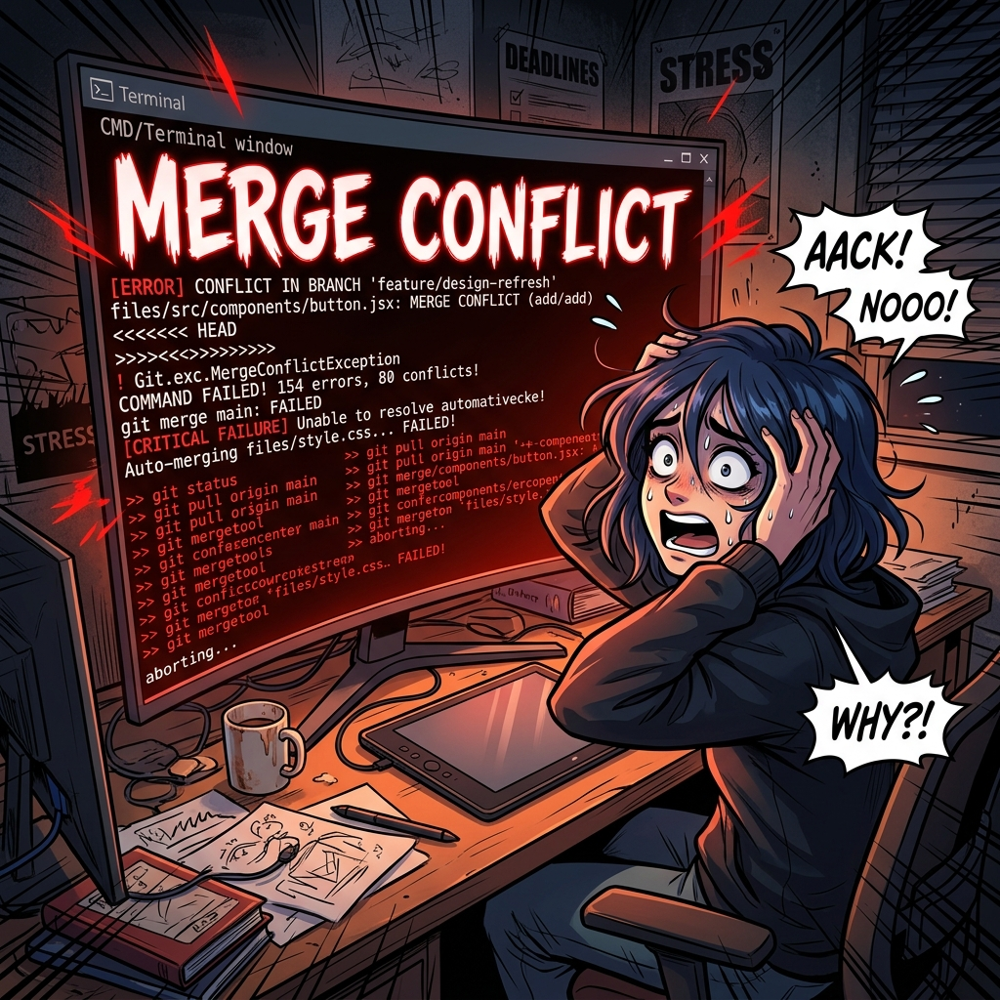

# Chapter 02: Antigravity 與 GitHub 協作

## 1. 痛點場景

👨 **你**：專案要交接，但我桌面全是「角色立繪_絕對最終版.psd」... 萬一刪錯圖層就全沒了！


👨 **你**：完蛋了！！我不小心把圖層全部平面化還按到儲存了！這下沒救了... 這時候如果你不知道甚麼叫做 Git，你就只能摸摸鼻子重新做一版了！

👨 **你**：網路上說用 Git 備份，就再也不怕老闆說要改回「第一版」。結果我滿懷希望打開教學，一看到那黑壓壓的「終端機」和滿滿的英文報錯... 救命，我只是做行銷設計的，為什麼要學工程師寫程式啊！


---

## 2. 階段一：時光旅行的概念

### 2.1 觀念一：GitHub 是設計專案的時空旅行器
*   **這不是工程師的專利**：老闆看完 V5 後說「還是上週一的 V1 比較好」。如果沒有 GitHub，你只能在垃圾桶裡挖檔案。
*   **無限 Ctrl+Z**：有了版控，只需一個按鍵，整個專案瞬間時光倒流回 V1 的完美狀態！就算不小心平面化存檔了也能救。

### 2.2 實作一：平面化儲存慘案
*(預計時間：20 分鐘)*
*   打開 Photoshop 的 **【圖層面板】** ➔ 在根圖層點擊右鍵選擇 **【影像平面化 (Flatten Image)】** ➔ 按下 **【Ctrl + S】** 儲存 ➔ **【關閉檔案】**。

> 重新打開檔案，體會一下無法按下 Ctrl+Z 救回心血的絕望感。
> 雖然知道要用 Git 救命，但打開終端機看到一堆英文指令 (`git commit` 等)，只覺得頭昏眼花根本不想學！這就需要下一個觀念：讓 Agent 代勞！

> **🚨 警告**：剛剛的實作只是為了讓各位體驗「痛點」。千萬不要拿真實的公司專案跟著做！如果在公司專案上真的平面化存檔... 你會需要的是時光機，不是 GitHub。

---

## 3. 階段二：終端機自動化

### 3.1 觀念二：讓 Agent 幫你做版控指令
*   **動口不動手**：很多人不學 Git 是因為指令太難記。現在透過 Antigravity，你只要說「幫我備份這個版本的圖」，Agent 會自動幫你敲打終端機指令並上傳。

**📄 .gitignore 撰寫範例與規則說明**：
`.gitignore` 是一個純文字檔，裡面寫的任何檔名或路徑，Agent (與 Git) 都會假裝沒看到，絕對不會把它們上傳到網路上。這對於保護機密或是過濾掉太肥大的檔案（如圖層很多的設計檔）非常重要！

**【 萬用字元 `*` 的超強大功能 】**
`*` 代表「任何字元、任意長度」。這就像是拿著大聲公喊「所有叫 OOO 的通通給我站出來」。

```text
# 1. 利用萬用字元 (*) 忽略特定副檔名
# 只要檔案結尾是 .psd，不管前面叫什麼名字 (例如 test.psd, final_v2.psd)，全部忽略！
*.psd
*.psb
*.ai

# 2. 忽略特定資料夾內的所有東西
# 加上斜線代表「資料夾」。這會把 assets 底下名為 private 的資料夾整包忽略。
/assets/private/

# 3. 忽略檔名包含特定關鍵字的檔案
# 只要檔名裡面有 "secret"，例如 my_secret_file.txt 或 secret_passwords.doc，都會被忽略。
*secret*

# 4. 【例外條款】使用驚嘆號 (!) 建立白名單
# 如果你忽略了所有 .psd，但唯獨想把「最終版 Logo」上傳備份，就可以用驚嘆號：
!final_logo.psd
```

**💬 示範指令**：
> 幫我把剛畫好的圖 commit 存檔，並自動加上 "修改人物臉部光影" 的版本紀錄推送到 GitHub。
> *(註：Commit 就像是為當前的畫布狀態拍一張「拍立得存檔 (Snapshot)」，並在照片背面寫下修改備註，未來隨時可以拿出來還原。)*

### 3.2 實作二：見證奇蹟
*(預計時間：40 分鐘)*
*   點擊 **【Antigravity Chat】分頁** ➔ 輸入：`「幫我把專案 commit 備份到 GitHub」` ➔ (再次製造平面化慘案) ➔ 輸入：`「幫我還原到上一個版本」`。

> 重新打開檔案，見證圖層一鍵復活的時光倒流魔術！

### ⚠️ 實作避坑 TIP
*   **資安慘劇**：一句自動存檔可能把商業機密公開，永遠記得先寫好 `.gitignore`。
*   **無腦覆蓋**：不要讓 Agent 遇到衝突時自動執行 Force Push (強制推送)。這相當於「撕毀別人的畫布」，不管三七二十一直接把同事畫好的圖撕掉貼上你自己的版本，極度危險。
