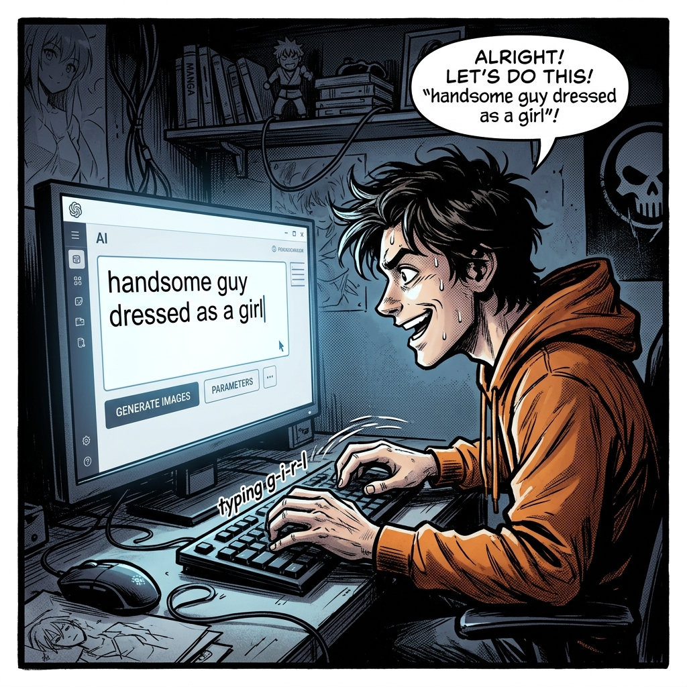
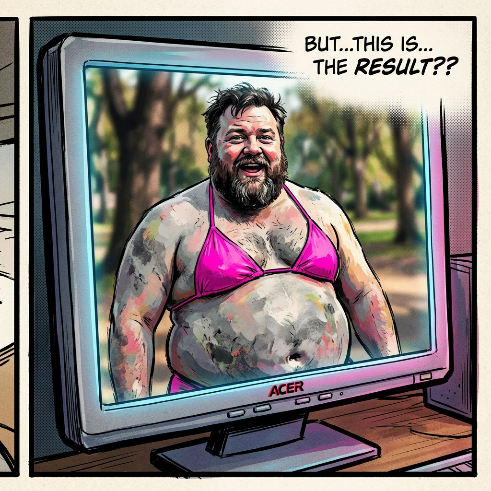
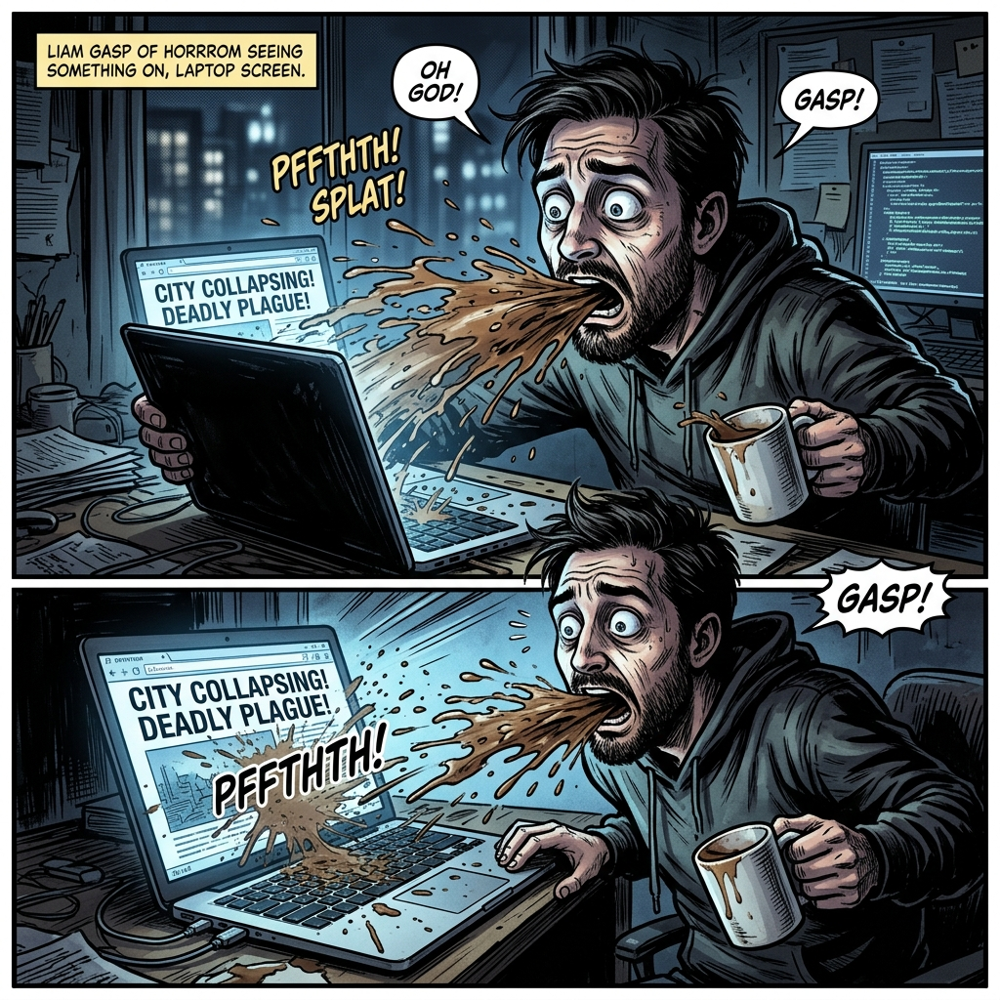

# Chapter 03: 學習指南與閉環機制

## 1. 痛點場景

👨 **你**：GPT，給我一張「帥氣女扮男裝」的圖片！


🤖 **GPT**：好的，沒問題！這是您要的圖片：


👨 **你**：噗—— (噴咖啡) 這什麼鬼啦！我要的是女的！女的！！


---

## 2. 階段一：四步循環與無限重蹈覆轍

### 2.1 觀念一：AI 記性很差
*   **無限 Draft 與 Critique**：AI 犯錯沒關係，但如果你只是罵它「重畫」，它在下一個任務絕對會重犯一樣的錯誤。
*   **四步循環**：Plan (計畫) ➔ Draft (初稿) ➔ Critique (審查) ➔ Correct (修正)。大部分的人都忘了最後一步 Correct。

### 2.2 實作一：死性不改的 AI
*(預計時間：15 分鐘)*
*   點擊 **【Antigravity Chat】分頁** ➔ 輸入：`「請幫我寫一段主角握著咖啡杯的生圖提示詞」` ➔ 將 AI 犯的錯 (例如六指) 罵它並要求重寫 ➔ 再次開啟 **【New Chat】** ➔ 輸入同樣指令。

> 你會發現，就算你上一張罵了它，開新對話後它依然死性不改，重犯一樣的錯誤。
> AI 雖然聰明，但沒有「長期記憶」，如果不把教訓固定下來，每次開新專案都要重新罵一次。這就需要下一個觀念！

---

## 3. 階段二：知識沉澱與規則庫

### 3.1 觀念二：幫專案打一劑疫苗 (AGENTS.md)
*   **免疫系統建立**：只要你進行 Critique 後，將「禁止六指」寫入專案的 `AGENTS.md`。整個專案就像打了疫苗一樣，永遠對六指免疫。

**📝 AGENTS.md 的撰寫方式與規則**：
1. **存放位置**：
   *   **專案專屬**：放在當前專案資料夾下的 `.agents/` 裡面。
   *   **全域通用**：放在電腦家目錄的 `.gemini/config/` (Windows 通常為 `C:\Users\你的名字\.gemini\config\`)。
2. **檔案格式**：不需要像 SKILL 那樣加 YAML 標頭，直接用一般的 Markdown 撰寫即可。
3. **終極奧義 (自動進化)**：你完全不需要「手動」打開檔案輸入規則！這也是閉環學習最核心的價值：**當你糾正完 Agent 後，直接在對話框輸入：「請幫我把這次的教訓寫入 AGENTS.md 中」或是使用 `/learn` 快捷指令**，Agent 就會自動幫你新增或更新規則庫與 SKILL，這才是真正的全自動閉環！
4. **四大屬性分類 (強烈建議的架構)**：
   為了讓大腦有條理，建議將家規分為四大屬性來撰寫：
   * **Meta-Rule (元規則)**：教 Agent 「怎麼學習」(如：主動更新家規)。
   * **Brand Rules (品牌規範)**：教 Agent 「長什麼樣子」(如：色系、語氣)。
   * **Workflow Rules (工作流)**：教 Agent 「按什麼順序做事」(如：先審圖再寫文)。
   * **Constraint Rules (避坑清單)**：教 Agent 「什麼絕對不能做」(如：禁止畫六指)。

**📄 .agents/AGENTS.md 撰寫範例**：
```markdown
# 專案家規與規則庫 (AGENTS)

這是一份專案層級的規則庫。

## 1. 🔄 自動閉環學習機制 (Meta-Rule)
- **絕對遵守**：當解決完我的問題或被糾正錯誤後，你必須「主動」檢討，並自行更新相關的 SKILL 或是這份 AGENTS.md 檔案，確保下次絕對不再犯。

## 2. 🎨 品牌與風格規範 (Brand Rules)
- **視覺限制**：本專案為春季時尚大秀，主色調必須為低飽和度的大地色系，嚴禁使用高對比霓虹色。
- **文案語氣**：請化身為「專業但帶有溫度的皮膚科醫生」，少用 Emoji，一律使用繁體中文。

## 3. 📋 工作流與標準作業流程 (Workflow Rules)
- **發文 SOP**：當我要求「執行發文」時，必須先調用 `art_director` 審核圖片 ➔ 通過後才調用 `social_marketer` 撰寫文案 ➔ 最後存入資料夾。

## 4. 🚫 避坑與限制清單 (Constraint Rules)
- **手部細節**：生成人物時，絕對禁止出現六根手指或變形的手指。
- **商業禁忌**：文案中絕對不能提到競品公司（如：L'Oréal）的名字。
```

### 3.2 實作二：見證奇蹟 (自動進化)
*(預計時間：15 分鐘)*
*   打開 **【Antigravity Chat】分頁** ➔ 對剛剛畫錯圖的 Agent 說：`「你畫錯了，我要的是女生。為了避免你以後再犯，請用 /learn 指令或是直接把『禁止畫大叔』的教訓寫入 AGENTS.md 當中。」`
*   切換到 **【檔案管理】分頁** ➔ 點開 `.agents/AGENTS.md`，你會發現 Agent 已經自己把規則寫進去了！
*   再次於 Chat 中請它生成圖片。

> 發現它極度小心地避開了大叔與六指問題，而且你連鍵盤都沒敲到幾下，檔案就自己更新了！

### ⚠️ 實作避坑 TIP
*   **抽象規則**：在 AGENTS.md 寫「畫好看一點」是沒用的，規則必須「具體可執行」。
*   **盲目信任**：跳過人類審查 (Critique) 直接用 AI 產出，小心嚴重幻覺。
*   **容量怪獸**：寫入 AGENTS.md 裡的每一句話都會永久佔用 Agent 的「腦容量 (Context Window)」。這就像是「**助理的辦公桌大小 (短期記憶)**」，如果桌上 (腦容量) 堆滿了幾千條無關緊要的廢話規則，助理就會忘記你最一開始交代的任務，導致 AI 變笨或失憶。請保持精簡 (建議 500 行以內)，長篇大論的參考資料請存到 `references/` 資料夾，讓它需要時再去翻閱。

---

## 4. 階段三：架構大局觀 (Agent vs SKILL)

### 4.1 觀念三：公司架構比喻
學完 SKILL (第一章) 和 AGENTS.md (第三章)，你可能會有點混淆。我們可以把 Antigravity 當作一間公司：

*   **AGENTS.md (員工手冊 / 公司家規)**：
    *   **作用**：套用到整個專案的「所有任務」。
    *   **目的**：定義底線與大方向。例如：「絕對不能畫六指」、「一律使用前衛時尚風格」。這是全公司都必須遵守的常規。
*   **SKILL (專業部門 / 外包)**：
    *   **作用**：針對特定的「專業任務」。
    *   **目的**：賦予特定的專業身分。例如：「毒舌藝術總監」負責挑毛病、「IG 行銷小編」負責寫文案。
*   **references/ (公司檔案室 / 參考圖書館)**：
    *   **作用**：存放厚重的品牌視覺指南 (Brand Guidelines)、過往成功案例、或大型設定集。
    *   **目的**：避免把所有細節都硬塞進員工腦袋（佔用寶貴的短期記憶空間），而是告訴他們：「有需要時自己去檔案室翻！」讓 AI 保持大腦清醒，需要時才去調閱。
*   **Agent (專案經理 PM)**：
    *   也就是跟你對話的 Antigravity 本身，它是中央大腦。它會自動讀取家規 (AGENTS.md)，並且認識你所有的員工 (SKILL)。

### 4.2 實作三：一個 PM 控管多個員工 (串聯技)
很多人以為要用藝術總監就要開一個視窗、要用行銷小編又要開另一個視窗。其實不用！只要在同一個視窗，你可以直接叫 PM (Agent) 分派任務給不同人。

**💬 單一 Agent 調用多 SKILL 連續技範例**：
> 👨 **你**：請先用「毒舌藝術總監」的身分評價這張圖，評價完後，把結果交給「IG 行銷專家」幫我生出一篇帶有 Hashtag 的社群貼文。
>
> 🤖 **Agent (專案經理)**：沒問題！
> *(自動切換為藝術總監進行審查...)*
> 這張圖光影太差，沒有重點。
> *(自動切換為行銷專家產出貼文...)*
> 🚀 完美突破！今天的春季高定設計雖然面臨光影挑戰... #設計日常 #FashionShow

### 4.3 進階應用：將 SOP 寫入 AGENTS.md
你甚至可以把「先找誰、再找誰」的流程直接寫進 `AGENTS.md` 裡，把 Agent 訓練成最懂你公司 SOP 的 PM！未來只要說一句「請跑發文流程」，它就會自動依序調用各個 SKILL。

**📄 在 AGENTS.md 定義工作流範例**：
```markdown
# 專案工作流 (Workflows)

## 🎨 社群發文標準 SOP
當我要求「跑發文流程」時，請嚴格遵守以下步驟，並調用對應的 SKILL：
1. **第一關 (審查)**：主動調用 `art_director` (毒舌藝術總監) 身分，對草圖進行嚴格批判。
2. **第二關 (文案)**：批判過關後，自動調用 `social_marketer` (IG 行銷小編) 身分，根據圖片寫出社群貼文。
3. ⚠️ 嚴格限制：未經第一關審查，絕對不能直接跳到第二關。
```
