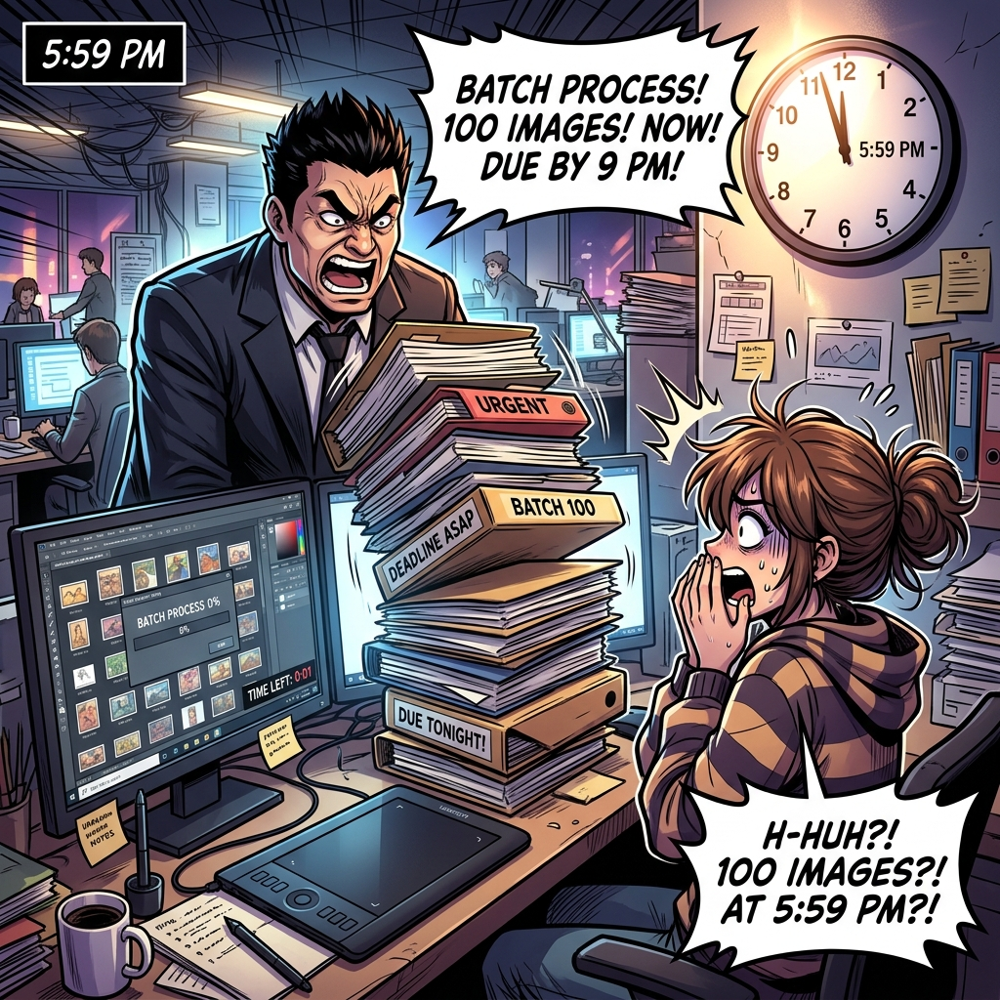
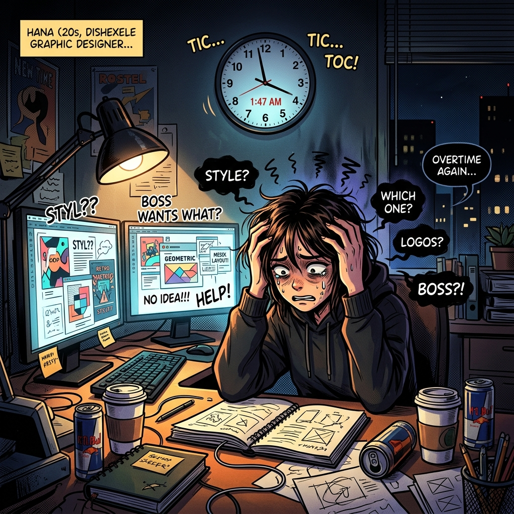

# Chapter 04: 高階快捷指令與自動化 (Slash Commands)

## 1. 痛點場景

🕴️ **老闆**：下班前把這 100 張圖套用前衛時尚風格處理完！明早開會要看！細節你自己想！


👨 **你**：(心想：今晚又要睡在公司了... 而且我根本不知道他要的前衛時尚細節是什麼！難道沒有可以自己想細節、又可以自動處理完的工具嗎？)


---

## 2. 階段一：長效任務與定時回報 (放手讓它做)

### 2.1 觀念一：`/goal` 與 `/schedule`
*   **死磕到底**：`/goal` 指令，普通指令跑一半可能需要你按確認，但加上 `/goal`，就等於對 Agent 說「不計代價，把這 100 張圖處理完為止」。它會自動嘗試、除錯，直到目標達成，非常適合下班前放著跑過夜。
*   **定時鬧鐘**：`/schedule` 指令，你可以設定定時器，例如「每小時檢查一次輸出結果，若出錯就透過推播通知我」，讓 Agent 在背景默默為你巡邏。

### 2.2 實作一：準時下班的魔法
*(預計時間：20 分鐘)*
*   點擊編輯器右側的 **【Antigravity Chat】分頁** ➔ 點擊下方的 **【對話輸入框】** ➔ 輸入內容：`「/goal 請幫我把這 100 張春季服裝參考草圖執行批次轉檔，遇到錯誤自動除錯直到全部完成」` ➔ 按下 **【Enter】發送**。

> 放開雙手，看著 Agent 在背景像瘋狗一樣自動拆解任務、自動修復報錯，而你可以直接拿起包包下班！
> 雖然 `/goal` 會自動跑 100 張圖，但如果我們一開始連「風格」都講不清楚，跑出來的 100 張全都是垃圾，依然沒救。這就需要下一個觀念！

### ⚠️ 實作避坑 TIP
*   **目標要明確**：使用 `/goal` 時，任務終點必須清晰 (例如「100 張全部轉換為 PNG」)。如果說「幫我畫到好為止」，Agent 會不知道什麼時候該停下來。
*   **定時炸彈**：設定 `/schedule` 時請勿將頻率設得太短 (例如每 10 秒)，以免洗版或耗盡電腦資源。

---

*(2.2 實作一結束)*

👨 **你**：雖然 `/goal` 很神，但如果我連自己要什麼都不知道，它也只會產出一堆我不要的垃圾啊！有沒有什麼指令是可以「幫我想靈感」的？

## 3. 階段二：靈魂拷問與永久記憶 (把 AI 當專家)

### 3.1 觀念二：`/grill-me` 與 `/learn`
*   **反客為主**：`/grill-me` 指令，當你靈感枯竭或需求模糊時，用這個指令讓 AI 反過來「面試你」。它會不斷逼問你細節（例如：燈光要多暗？服裝是什麼材質？），直到釐清真正的設計需求。
*   **永恆印記**：`/learn` 指令，當你辛苦調教出完美的 Prompt，只要打 `/learn`，Agent 就會自動分析剛才的對話，並把這套經驗寫入大腦 (AGENTS.md 或 Skills 中)，下次直接變成這方面的專家。

**💬 `/grill-me` 互動對話範例**：
```text
👨 你：/grill-me 我想設計一套前衛的春夏高定服裝，但我沒想法。
🤖 Agent：好的！為了幫您產出最精準的設定，請問：
   1. 這個角色的職業是什麼？(駭客/傭兵/還是財閥高層？)
   2. 身上主要的發光體顏色是什麼？(霓虹粉/螢光綠？)
👨 你：他是個駭客，主要顏色是螢光綠，而且戴著面具。
🤖 Agent：收到！(將靈感轉化為精確的設計需求清單...)
```

### 3.2 實作二：靈感壓榨機與傳家寶
*(預計時間：25 分鐘)*
*   點擊 **【Antigravity Chat】分頁** ➔ 點擊下方的 **【對話輸入框】** ➔ 輸入：`「/grill-me 我想為春季高定系列設計一套前衛的服裝，但我沒想法」` ➔ 經歷三輪 AI 的逼問並給予回答 ➔ 獲得完美解答後，輸入：`「/learn 記住我今天對於春季高定服裝的偏好」`。

> 體驗從「不知道要什麼」到「被 AI 引導出具體靈感」的過程，並親眼見證它自動把這個過程寫成經驗法則！

### ⚠️ 實作避坑 TIP
*   **避免亂學 (垃圾進垃圾出)**：不要在充滿錯誤測試的對話紀錄中使用 `/learn`，以免 Agent 記住了一堆無用的垃圾資訊，這會佔用寶貴的辦公桌 (腦容量) 空間！請在獲得最終完美結果後再呼叫 `/learn`。
