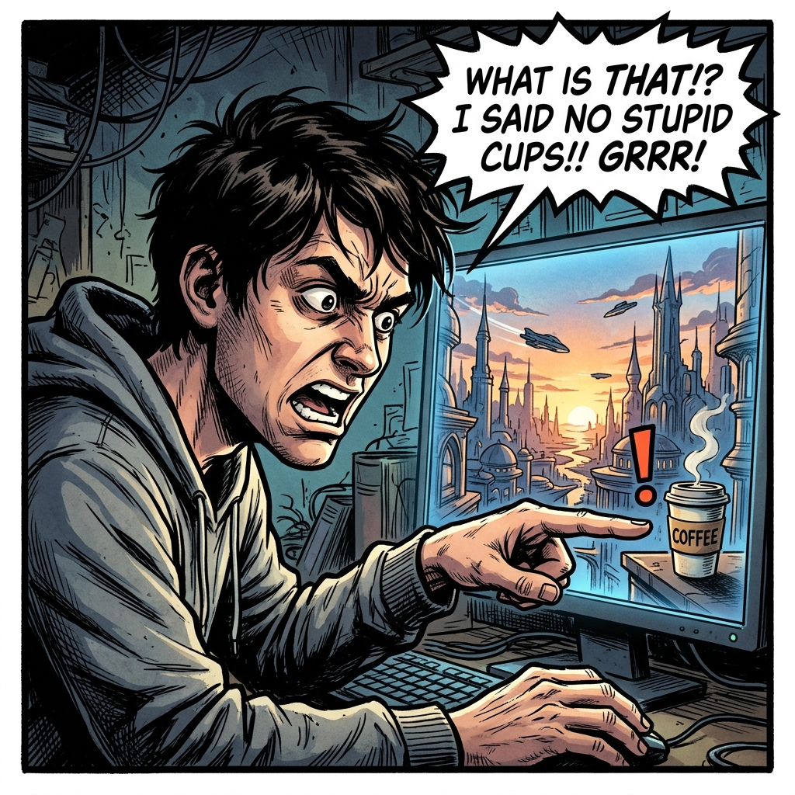
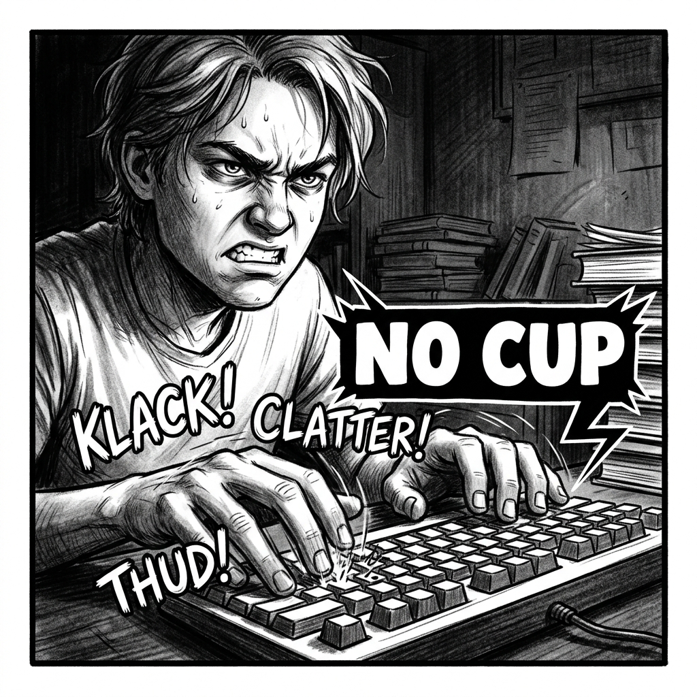
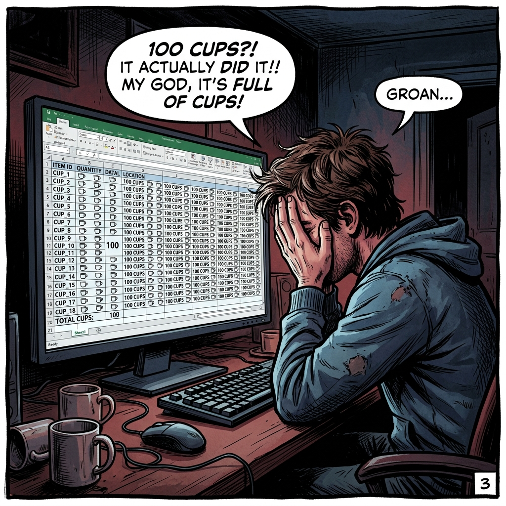

# Chapter 06: 進階提示詞與 Comfy Cloud 準備

## 1. 痛點場景

👨 **你**：這張圖很完美，但右上角那頂帽子太多餘了！


👨 **你**：GPT，重畫！「不要帽子」！


🤖 **GPT**：收到您的指示，已為您強調「帽子」！


---

## 2. 階段一：控制變因

### 2.1 觀念一：正向與負向提示詞的拉扯
*   **不要寫流水帳**：如果你在普通輸入框寫「不要出現飛車」，模型很可能會因為看到了「帽子」這個詞，反而加強了飛車的權重。
*   **明確拆分**：必須在系統層級精準拆分 正向提示 (要什麼) 與 負向提示 (絕對不能出現什麼)。

### 2.2 實作一：隨興崩壞生成
*(預計時間：20 分鐘)*
*   打開 **【Comfy Cloud】分頁** ➔ 找到 **【CLIP Text Encode】** 節點（*註：這是一個「**外星語翻譯官**」，負責把你輸入的人類語言咒語，精準翻譯成 AI 腦袋聽得懂的機器語言*） ➔ 輸入流水帳：`「畫一個前衛時尚模特兒，不要帽子，背景要有光」` ➔ 點擊右上角 **【Queue Prompt】按鈕**。

> 結果產出了一張滿頭帽子的崩壞圖，越描越黑。
> 如果我們只用「一句話」把所有需求塞進去，AI 根本分不清主從輕重，甚至會被「不要飛車」的帽子兩字誤導。這就需要下一個觀念！

---

*(2.2 實作一結束)*

👨 **你**：AI 怎麼比聽不懂人話的客戶還難搞？到底要怎麼跟它說話，它才會乖乖聽話？

## 3. 階段二：三段式公式框架

### 3.1 觀念二：把提示詞當作外包發包單
*   **外包需求單**：如果你只說「畫個城市」，每個外包畫的都不一樣。結構化就是強制定義：【主體：城市】+【環境：下雨】+【光影：霓虹燈】，不給 AI 自由搞砸的空間。

**📄 三段式結構發包單範例**：
```text
[Positive Prompt - 正向提示 (要什麼)]
(主體) a fashion model, avant-garde spring dress
(環境) runway, background lights
(光影) cinematic lighting, high contrast

[Negative Prompt - 負向提示 (絕對不要什麼)]
hat, ugly, deformed, missing limbs, bad anatomy, text, watermark
```

**✅ 結構化示範**：
> **Positive**: 一位穿著春季洋裝的模特兒
> **Negative**: 帽子、模糊、多餘的物件

### 3.2 實作二：確認成果
*(預計時間：25 分鐘)*
*   在 **【CLIP Text Encode (Positive)】** 節點輸入：`「前衛春季高定模特兒, 秀場背景」` ➔ 在下方的 **【CLIP Text Encode (Negative)】** 節點輸入：`「帽子」` ➔ 點擊 **【Queue Prompt】按鈕**。

> 再次生成，精準產出毫無帽子的完美春季高定模特兒，見證結構化的控制力！

### ⚠️ 實作避坑 TIP
*   **提示詞衝突**：同時寫「黑夜」與「陽光普照」會讓模型精神分裂。
*   **忽略負面提示**：忘記把不要的東西寫進 Negative Prompt，是產出劣質圖 (如變形、六指) 的主因。
*   **靈感枯竭 (找大師代筆)**：記不起來完整的結構化單字沒關係！還記得我們在第一章安裝的 `comfyui-prompt-engineer` (提示詞大師) 嗎？當你不知道怎麼寫提示詞時，直接叫 Agent 調用他，告訴他「我要前衛春季高定服裝」，他就會幫你生出完美的 Positive / Negative 結構化發包單！
