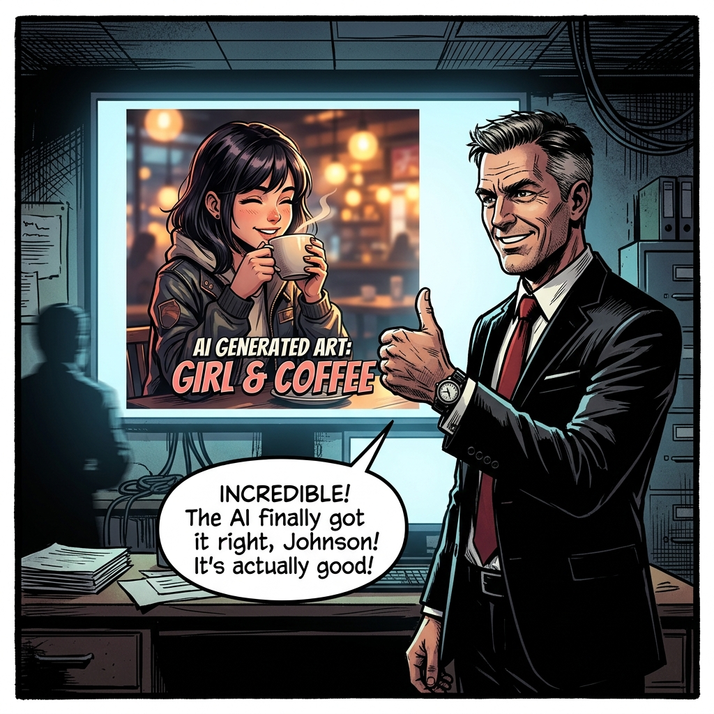
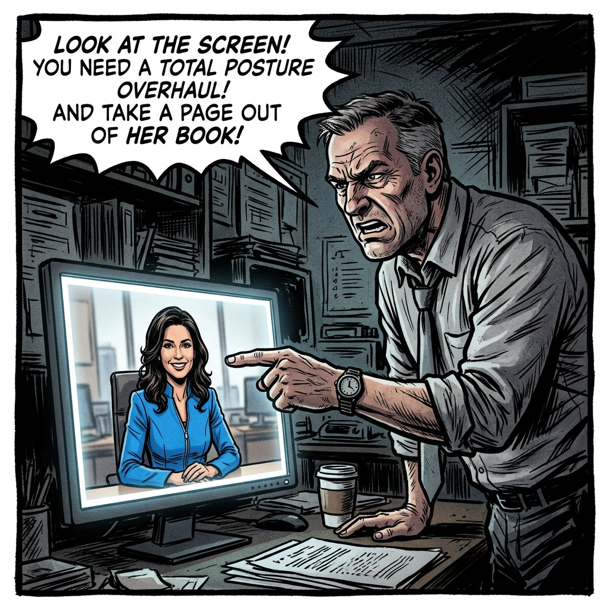

# Chapter 07: Comfy Cloud 實戰

## 1. 痛點場景

🕴️ **老闆**：哇這張海報太棒了！我要同一個女生換個姿勢喝咖啡。


👨 **你**：(心想：完蛋了，Midjourney 只能抽盲盒...)


🕴️ **老闆**：這根本不同人啊！重做！！！


---

## 2. 階段一：圖層 vs 節點架構

### 2.1 觀念一：圖層與節點的差異 (疊漢堡 vs 拉水管)
*   **圖層架構 (疊漢堡)**：由下往上堆疊，屬於**「結果導向」**，破壞性高。
    *   **🚨 痛點案例 (淺景深效果)**：老闆要求把背景做「淺景深模糊」，在 PS 裡如果已經平面化了就極難處理；就算沒平面化，你也必須「複製一次原圖層」才能做模糊。若後來原圖換了，模糊圖層就得全部重做！
*   **節點式 (拉水管)**：像畫心智圖拉水管，屬於極度自由的**「過程導向」**。
    *   **✨ 節點優勢 (完美自動套用)**：你只需把「第一步的原圖節點」拉一根水管出來接上「模糊節點」。最棒的是，未來無論最源頭的原圖替換成什麼，這個淺景深效果都會完美、自動地套用到新節點上，完全不用重做！

### 2.2 實作一：抽盲盒地獄
*(預計時間：30 分鐘)*
*   打開 **【Comfy Cloud】分頁** ➔ 找到畫面中央的 **【KSampler】** 節點，將它的 `seed` 屬性設定為 `randomize` ➔ 點擊右上角的 **【Queue Prompt】** 按鈕生成一張滿意的「春季高定模特兒」圖片 ➔ 稍微修改你的 Prompt 文字 ➔ 再次點擊 **【Queue Prompt】**。

> 發現原本滿意的構圖與春季模特兒長相全部跑掉，體會無法掌控模型的無力感。
> 雖然只是想換個姿勢，但因為「隨機抽盲盒」的特性，導致連人物長相跟背景都全變了。我們需要把「底層基因」鎖住，這就需要下一個觀念！

---

☕ **大腦冷卻時間 / 實作緩衝**：
太棒了！我們剛剛體驗了隨機抽盲盒的無力感。請先喝口水休息一下，別被一直變臉的模特兒搞瘋了。接下來我們要教你如何鎖死這些基因，讓構圖不再亂跳！

---

*(2.2 抽盲盒地獄結束)*

👨 **你**：這也太難控制了，有沒有辦法至少讓它的「構圖跟整體感覺」不要每次都全變？

## 3. 階段二：鎖定初始基因 (Seed)

### 3.1 觀念二：鎖定初始基因 (Seed)
*   **Seed (隨機種子碼)**：就像是這張圖的 **DNA 基因碼**。鎖定 Seed，就能讓整體的「初始氛圍與構圖」不再隨機亂跳。

**📄 關鍵節點參數設定範例**：
```text
【KSampler 運算節點】
- seed: 15923058 (隨機產生的一串數字，這就是這張圖的 DNA 基因碼)
- control_after_generate: fixed (關鍵！將隨機改為「固定」，鎖死基因)
- steps: 20 (通常 20~30 就夠了，拉太高會產生油畫破圖感)
```

**💬 示範：節點基本串接邏輯**：
> [Prompt 節點] ➔ [KSampler 降噪運算 (**靈魂畫師**，負責從雜訊中雕刻出影像)] ➔ [VAE Decode 轉成圖片 (**底片沖洗室**，將抽象數據洗成完美像素)]

### 3.2 實作二：固定基因碼
*(預計時間：15 分鐘)*
*   在 **【KSampler】** 節點將屬性 `control_after_generate` 改為 **【fixed (固定)】** ➔ 修改 Prompt ➔ 點擊 **【Queue Prompt】**。

> 再次微調提示詞，你會發現雖然長相還是會受提示詞影響而改變，但「整體的構圖基底與光影氛圍」被成功鎖定了，不再像是抽盲盒般毫無頭緒！

---
👨 **你**：太好了，感覺對了！但我現在想要他「舉起右手」，要怎麼精準控制姿勢？

## 4. 階段三：強制操線木偶 (ControlNet)

### 4.1 觀念三：強制操線木偶 (ControlNet)
*   **ControlNet (控制網)**：如果說 Seed 是鎖定氛圍，那 ControlNet 就是設計師專用的 **強制描圖紙 (或操線木偶)**。不論你怎麼改提示詞，AI 都必須乖乖沿著你提供的邊緣線 (Lineart) 或人物骨架 (OpenPose) 來上色。完美解決了「AI 不聽話亂擺姿勢」的痛點。

### 4.2 實作三：精準描圖
*(預計時間：25 分鐘)*
*   在畫布空白處 **點擊兩下左鍵**，畫面會跳出一個搜尋框 ➔ 輸入並加入 **【ControlNet Apply】** 與 **【Load Image】** 節點。
*   在上方的 **【Load Image】** 節點上傳一張有明確骨架或邊緣線的模特兒參考圖 ➔ 用滑鼠左鍵點住原圖的黃色小圓點，拖曳連線到 ControlNet 的輸入端 ➔ 再次點擊右上角的 **【Queue Prompt】**。

> 體會當你加上「強制描圖紙」後，AI 乖乖讓春季高定模特兒擺出你要的姿勢的強大控制力！

### ⚠️ 實作避坑 TIP
*   **迷信高數值**：無腦拉高 Steps 到 100 不會更好看，只會產生油畫破圖感。
*   **迷信 Seed 能鎖定長相**：Seed 只能鎖住「初始雜訊 (構圖基底)」。如果老闆要求「同一個模特兒換姿勢」，光靠 Seed 是做不到的，這也是為什麼我們接著學 ControlNet，甚至未來還需要套用進階的 **FaceID (臉部辨識)** 或 **LoRA (外觀擴充包)**。
*   **點數燒光地獄 (成本控管)**：雲端生圖服務通常是計次扣點。在按下 Generate (生成) 之前，請養成好習慣：先用低解析度、低步數 (Steps: 10-15) 快速「盲測」構圖，等確定 AI 有聽懂你的指令、構圖對了，再來花大點數拉高解析度算高清圖。千萬不要一開始就開最高畫質狂抽盲盒，你的點數會瞬間燒光！

---

---

*(4.2 實作三結束)*
💡 **【大腦冷卻時間】ControlNet 是個非常複雜的觀念，我們先稍微消化一下剛剛學到的強制描圖威力。準備好後，我們即將進入最容易當機的模組相容性地獄！**

👨 **你**：老闆說他想要這種「黏土人」的可愛風格，我剛剛去 Civitai 下載了一個超讚的 SDXL 黏土人 LoRA，馬上接上去看看！
*(你把新下載的 LoRA 節點接上原本的 SD1.5 工作流...)*
💻 **ComfyUI**：🚨 `Error: mat1 and mat2 shapes cannot be multiplied...` (滿江紅錯誤畫面)
👨 **你**：這什麼鬼錯碼？！我只是想加個濾鏡啊！

## 5. 階段四：模型血型匹配 (Model Architecture)

### 5.1 觀念四：模型血型匹配 (Model Architecture)
在解決報錯前，我們先來搞懂這些常常出現的英文縮寫到底是什麼：

*   **Checkpoint (主模型)**：這是整個 AI 的**「大腦與身體」**。它決定了基礎的畫風（如：寫實、二次元）與理解能力。檔案通常非常巨大（好幾 GB）。
*   **VAE (底片沖洗室)**：全名是 Variational Autoencoder。AI 畫完圖時，其實是一堆人類看不懂的抽象數據 (Latent)。VAE 負責將這些數據**「沖洗」**成我們肉眼可見的完美像素圖片。如果沒接 VAE 或接錯，圖就會像洗壞的照片，變成一片灰暗或彩色雜訊。
*   **LoRA (外觀擴充包 / 特效濾鏡)**：全名是 Low-Rank Adaptation。如果你想讓主模型畫出特定的「某個角色」或「某種特定畫風（如：黏土人）」，不需要重訓練一個巨大模型，只要掛上一個幾百 MB 的 LoRA 擴充包，就像是**「給相機掛上特殊濾鏡」**一樣，瞬間改變風格。

**模型也有「血型」或「主機平台」**
* **模型血型匹配 (Model Architecture)**：這是初學者最常遇到的地獄。AI 模型有分不同的世代架構 (例如：SD1.5, SDXL, FLUX)。這就像是你不能把 **PS5 的遊戲光碟 (SDXL LoRA)** 硬塞進 **PS4 的主機 (SD1.5 Checkpoint)** 裡一樣，硬塞只會當機報錯。
* **輸血理論 (相容性比喻)**：
  * **Checkpoint (主模型)** = 病人 (例如：A型血的 SDXL)
  * **VAE / LoRA / ControlNet (附屬模型)** = 血袋 (必須也是 A型血的 SDXL 配件)
  * 如果你拿 SD1.5 的 VAE 輸血給 SDXL 的病人，輕則產出像彩色雜訊的亂碼圖，重則直接跳紅字錯誤 (mat1 and mat2 shapes cannot be multiplied)。

### 💡 關鍵技巧一：下載時如何一眼辨識它是 Checkpoint 還是 LoRA？
當你在 Civitai 等網站下載模型時（例如看到：`bf16 SafeTensor`, `11.46 GB`），可以透過以下三個關鍵字線索來判斷：
1. **看體重 (檔案大小 File Size)**：這是最準確的物理指標。
* **核心主模型 (Checkpoint)**：通常高達 **6GB 到 12GB 以上**（裝滿了幾億張圖的記憶體）。
* **外觀擴充包 (LoRA)**：通常只有 **幾十到幾百 MB**。
2. **看格式與精度關鍵字**：
* **安全模型格式 (`.safetensors`)**：這是目前最安全的模型副檔名（絕對不會中毒）。
* **畫質精度標示 (`bf16` / `fp16` / `fp8`)**：這是代表模型的畫質與大小版本（就像 RAW 檔或 JPG 檔）。
3. **看身分證標籤 (Type)**：下載頁面通常會明確標示 `Type: Checkpoint` 或是 `Type: LoRA`。

### 💡 關鍵技巧二：如何辨識與匹配血型？
要避免輸錯血，你需要學會「驗血」的三大招：
1. **看下載點的身分證 (Civitai Tag)**：去 Civitai 下載任何模型時，右側資訊欄一定會有一行叫做 **「Base Model」** (例如標示 `SD 1.5`、`SDXL` 或 `FLUX.1 D`)，這就是它的絕對血型。
2. **看檔名的明示暗示**：大部分好心的作者會在檔名加上血型後綴。例如 `korean_style_xl.safetensors` (看到 xl 就是 SDXL)、`anime_flux_v1.safetensors`。
3. **一條龍對齊法則**：如果你決定今天這個工作流要用 `FLUX`，那請確保你的 **Checkpoint**、**VAE**、**LoRA** 甚至 **ControlNet**，全部都要去找名字裡帶有 FLUX 的版本。只要有一個環節混入 SD1.5，整個管線就會報錯！

### 5.1.5 觀念補充：什麼是精度 (FP16 / FP8)？需要匹配嗎？
除了血型 (架構) 外，你在下載模型時常會看到 `FP16`、`FP8` 甚至 `GGUF` 等字眼。這稱為**「模型精度 (Precision)」**。

* **生活化比喻 (影像格式)**：
* **豪華原畫質 (FP16)**：就像是相機的 **RAW 檔**。保留了最完美的色彩與光影細節，但檔案超級肥大，會吃掉很多顯卡記憶體 (VRAM)。
* **輕量壓縮版 (FP8)**：就像是高品質的 **JPG 檔**。檔案大小直接少一半，跑得更快，而且對設計師來說「肉眼幾乎看不出畫質差異」。
* **精度需要匹配嗎？ 完全不需要！**
  * 延續輸血理論，精度只是「血袋的包裝大小與材質」。只要血型 (例如都是 FLUX) 正確，ComfyUI 這家神醫醫院就能自動適應不同的包裝。
  * **完美混搭示範**：你可以毫無顧忌地將 **FP8 的 Checkpoint** (為了省記憶體與加速) 搭配 **FP16 的 VAE** (為了確保最終沖洗的照片色彩鮮豔無損)，系統會自動在底層轉換，絕對不會報錯！

### 5.2 實作四：修復血型衝突地獄
*(預計時間：15 分鐘)*
* 在畫布上載入一個刻意設計成「血型衝突」的工作流 (例如 Checkpoint 是 FLUX，但 VAE 卻接了 SDXL 的版本)。
* 點擊 **【Queue Prompt】** ➔ 觀察 VAE Decode 節點爆出紅字錯誤。
* 點選爆出紅字錯誤的 VAE 節點，並按下鍵盤的 **【Delete 鍵】(Mac 鍵盤請按 Delete 或是 fn+Backspace)** 將其刪除。
* 接著在空白處 **雙擊左鍵** 開啟搜尋框，載入正確對應 FLUX 血型的 `ae.safetensors` VAE 節點，再用滑鼠將節點上的小黃點重新連線 ➔ 再次點擊 **【Queue Prompt】** 生成。

> 體會從「滿江紅錯誤」到「成功洗出漂亮照片」的成就感！以後看到 tensor size 錯誤，第一反應就是「啊，血型不合啦！」。

### ⚠️ 實作避坑 TIP
* **下載前先看血型**：去 Civitai 下載任何模型 (LoRA, Checkpoint) 時，右上角一定會標示它是 `SD 1.5`、`SDXL` 還是 `Pony`。請務必確認它跟你的工作流主模型血型一致！
* **VAE 也是共犯**：很多時候 Checkpoint 沒接錯，是後面的 **VAE Decode (底片沖洗室)** 拿錯了洗劑。SDXL 必須配 SDXL 專用的 VAE，FLUX 必須配 FLUX 專用的 VAE。

---

## 6. 階段五：站在巨人的肩膀上 (ComfyCloud 範本)

### 6.1 觀念五：一鍵套用神級工作流 (Templates)
*   **不需從零造輪子**：剛剛提到的 **FaceID** 或 **LoRA**，如果要自己從零開始拉節點，可能會拉出上百條水管，像蜘蛛網一樣可怕。工程師懂這點痛，所以 ComfyCloud 內建了「**範本 (Templates)**」功能。
*   **一鍵套用神級工作流**：你可以直接載入別人寫好的「完美換衣工作流」或「商攝合成工作流」。對設計師來說，我們只需要「**換圖片、換提示詞、按生成**」，不需要管背後的水管怎麼接！

### 6.2 實作五：一鍵套用範本
*(預計時間：10 分鐘)*
*   在 **【Comfy Cloud】分頁** ➔ 點擊上方的 **【Templates (範本)】** 按鈕 ➔ 搜尋並點擊 **【FaceID 完美換裝】** ➔ 觀察畫布瞬間載入幾十個節點。
*   在最左側的 **【Load Image】** 節點上傳我們剛剛算出來最滿意的「春季高定模特兒」臉部照片 ➔ 點擊 **【Queue Prompt】**。

> 享受「站在巨人肩膀上」的快感！無腦產出商業級別的完美一致性圖片。這位模特兒現在已經徹底成為你的春季高定專屬代言人了！
